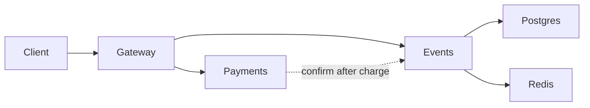

# Lab 1 Submission — Deploy, Break, Understand

> **Note:** All commands use **Podman** instead of Docker. Equivalent commands:
> - `podman compose` instead of `docker compose`
> - `podman stats` instead of `docker stats`

---

## Task 1 — Deploy & Break QuickTicket

### 1.1 Podman Compose PS (all 5 services running)

```text
CONTAINER ID  IMAGE                                 COMMAND               CREATED             STATUS                       PORTS                   NAMES
3203523d2fe5  localhost/app_payments:latest         uvicorn main:app ...  About a minute ago  Up 53 seconds                0.0.0.0:8082->8082/tcp  app_payments_1
4d34c5b743ac  docker.io/library/postgres:17-alpine  postgres              About a minute ago  Up About a minute (healthy)  0.0.0.0:5432->5432/tcp  app_postgres_1
14cadf4af5fc  docker.io/library/redis:7-alpine      redis-server          About a minute ago  Up About a minute (healthy)  0.0.0.0:6379->6379/tcp  app_redis_1
dc58b478c2d7  localhost/app_events:latest           uvicorn main:app ...  About a minute ago  Up About a minute            0.0.0.0:8081->8081/tcp  app_events_1
1947cd0f0be8  localhost/app_gateway:latest          uvicorn main:app ...  About a minute ago  Up About a minute            0.0.0.0:3080->8080/tcp  app_gateway_1
```

Deploy command used:

```bash
cd app/
podman compose up --build -d
```

### 1.2 Critical Path (list → reserve → pay)

**List events:**

```json
[
    {
        "id": 1,
        "name": "Go Conference 2026",
        "venue": "Main Hall A",
        "date": "2026-09-15T09:00:00+00:00",
        "total_tickets": 100,
        "price_cents": 5000,
        "available": 96
    },
    ...
]
```

**Reserve:**

```json
{
    "reservation_id": "394222a0-3702-4826-aaa6-47f79f8f8796",
    "event_id": 1,
    "quantity": 1,
    "total_cents": 5000,
    "expires_in_seconds": 300
}
```

**Pay:**

```json
{
    "order_id": "394222a0-3702-4826-aaa6-47f79f8f8796",
    "event_id": 1,
    "quantity": 1,
    "total_cents": 5000,
    "status": "confirmed"
}
```

**Health check:**

```json
{
    "status": "healthy",
    "checks": {
        "events": "ok",
        "payments": "ok",
        "circuit_payments": "CLOSED"
    }
}
```

### 1.3 Read the Architecture



Text form:

```
Client → gateway
gateway → events → postgres
gateway → events → redis
gateway → payments
gateway → events (confirm after payment)
```

**Key observations from reading the code:**

- `gateway/main.py` proxies `/events` and `/reserve` to the events service, and `/pay` to payments then confirms via events.
- `events/main.py` reads event data from Postgres and stores reservations in Redis with a 5-minute TTL.
- `payments/main.py` is stateless — it only processes charges and returns a `payment_ref`.

### 1.4 Systematic Failure Exploration

| Component Killed | Events List | Reserve | Pay | Health Check | User Impact |
|-----------------|-------------|---------|-----|--------------|-------------|
| payments        | ✅ Works (200) | ✅ Works (200) | ❌ Fails (502 → 503 after fix) | ⚠️ Degraded (503, payments=down) | Can browse and reserve tickets, but cannot complete payment |
| events          | ❌ Fails (504 timeout) | ❌ Fails (504 timeout) | ❌ Fails (500 — payment succeeds but confirm fails) | ⚠️ Degraded (503, events=down) | Entire ticket flow broken; pay may charge without confirming order |
| redis           | ✅ Works (200) | ❌ Fails (504 timeout) | ❌ Fails (500 — confirm fails, reservation not found) | ⚠️ Degraded (503, events=down) | Can list events but cannot hold reservations; stale availability counts |
| postgres        | ❌ Fails (502) | ❌ Fails (500) | ❌ Fails (500) | ⚠️ Degraded (503, events=degraded) | Complete system failure for all write operations; reads also fail |

### 1.5 Run the Load Generator

```text
QuickTicket Load Generator
Target: http://localhost:3080 | RPS: 5 | Duration: 30s
---
[10s] requests=39 success=38 fail=1 error_rate=2.5%
[10s] requests=40 success=39 fail=1 error_rate=2.5%
[10s] requests=41 success=39 fail=2 error_rate=4.8%
[10s] requests=42 success=40 fail=2 error_rate=4.7%
[20s] requests=80 success=75 fail=5 error_rate=6.2%
[20s] requests=81 success=75 fail=6 error_rate=7.4%
[20s] requests=82 success=76 fail=6 error_rate=7.3%
[20s] requests=83 success=77 fail=6 error_rate=7.2%
---
Done. total=121 success=113 fail=8 error_rate=6.6%
```

Error rate jumped from 0% to ~7% after `podman compose stop payments` at the 8-second mark. The ~10% of traffic that goes through the full purchase flow (reserve + pay) started failing.

---

## Task 2 — Graceful Degradation

### Gateway diff (`git diff app/gateway/main.py`)

```diff
diff --git a/app/gateway/main.py b/app/gateway/main.py
index c86db33..56a1541 100644
--- a/app/gateway/main.py
+++ b/app/gateway/main.py
@@ -331,14 +331,38 @@ async def pay_reservation(reservation_id: str):
         payment_ref = pay_resp.json().get("payment_ref", "unknown")
     except CircuitOpenError:
         log.error("circuit open, skipping payments call")
-        raise HTTPException(503, "Payment service temporarily unavailable (circuit open)")
+        return JSONResponse(
+            status_code=503,
+            content={
+                "error": "payments_unavailable",
+                "message": "Payment service is temporarily down. Your reservation is held — try again in a few minutes.",
+                "reservation_id": reservation_id,
+            },
+        )
+    except httpx.ConnectError:
+        log.error(f"payments unreachable for reservation {reservation_id}")
+        return JSONResponse(
+            status_code=503,
+            content={
+                "error": "payments_unavailable",
+                "message": "Payment service is temporarily down. Your reservation is held — try again in a few minutes.",
+                "reservation_id": reservation_id,
+            },
+        )
     except httpx.TimeoutException:
         raise HTTPException(504, "Payment service timeout")
     except httpx.HTTPStatusError as e:
         raise HTTPException(e.response.status_code, "Payment failed")
     except Exception as e:
         log.error(f"payment error: {e}")
-        raise HTTPException(502, "Payment service unavailable")
+        return JSONResponse(
+            status_code=503,
+            content={
+                "error": "payments_unavailable",
+                "message": "Payment service is temporarily down. Your reservation is held — try again in a few minutes.",
+                "reservation_id": reservation_id,
+            },
+        )
```

### Verification (payments down)

**Reserve — still works:**

```json
{
    "reservation_id": "cfc50b86-4d02-45c2-a00f-bb72c0fda39a",
    "event_id": 1,
    "quantity": 1,
    "total_cents": 5000,
    "expires_in_seconds": 300
}
```

**Pay — clear 503 with actionable message:**

```text
HTTP/1.1 503 Service Unavailable

{
    "error": "payments_unavailable",
    "message": "Payment service is temporarily down. Your reservation is held — try again in a few minutes.",
    "reservation_id": "cfc50b86-4d02-45c2-a00f-bb72c0fda39a"
}
```

---

## Task 3 — GitHub Community

**Why starring repositories matters:** Stars serve as bookmarks for interesting projects and signal community trust to maintainers. A high star count helps open-source projects gain visibility and encourages continued development.

**How following developers helps:** Following developers on GitHub lets you discover new projects through their activity, stay updated on classmates' work for future collaboration, and build professional connections beyond the classroom.

---

## Bonus Task — Resource Usage Under Load

All measurements taken with `podman stats --no-stream`.

### B.1 Baseline (idle, no traffic)

| Container | CPU % | Memory | Net I/O | PIDs |
|-----------|------:|--------|---------|-----:|
| app_events_1 | 0.43% | 42.68 MB | 14.5 kB / 11.7 kB | 2 |
| app_gateway_1 | 0.43% | 39.74 MB | 14.2 kB / 10.1 kB | 2 |
| app_payments_1 | 0.39% | 35.03 MB | 3.3 kB / 1.8 kB | 2 |
| app_postgres_1 | 0.19% | 24.60 MB | 10.6 kB / 5.8 kB | 8 |
| app_redis_1 | 0.87% | 4.34 MB | 8.2 kB / 2.2 kB | 6 |

### B.2 Under load (10 RPS, 30s)

Load generator: `total=212 success=212 fail=0 error_rate=0%`

| Container | CPU % | Memory | Net I/O | PIDs |
|-----------|------:|--------|---------|-----:|
| app_events_1 | 0.54% | 43.33 MB | 153.6 kB / 202.6 kB | 2 |
| app_gateway_1 | 0.65% | 40.47 MB | 178.6 kB / 168.6 kB | 2 |
| app_payments_1 | 0.39% | 35.41 MB | 8.1 kB / 5.3 kB | 2 |
| app_postgres_1 | 0.22% | 25.45 MB | 88.3 kB / 97.6 kB | 8 |
| app_redis_1 | 0.86% | 3.72 MB | 28.3 kB / 10.6 kB | 6 |

### B.3 Under stress with fault injection

Payments restarted with `PAYMENT_FAILURE_RATE=0.3 PAYMENT_LATENCY_MS=500`:

```json
{"status": "healthy", "failure_rate": 0.3, "latency_ms": 500}
```

Load generator: `total=133 success=128 fail=5 error_rate=3.7%`

| Container | CPU % | Memory | Net I/O | PIDs |
|-----------|------:|--------|---------|-----:|
| app_events_1 | 2.60% | 43.51 MB | 109.4 kB / 140.9 kB | 2 |
| app_gateway_1 | **3.43%** | 40.55 MB | 119.5 kB / 117.2 kB | 2 |
| app_payments_1 | 1.51% | 36.90 MB | 10.5 kB / 5.5 kB | 2 |
| app_postgres_1 | 0.64% | 23.24 MB | 62.3 kB / 65.6 kB | 8 |
| app_redis_1 | 0.78% | 4.34 MB | 22.8 kB / 8.5 kB | 6 |

### Analysis

**Most memory at rest:** `events` (~43 MB) — Python runtime plus psycopg2 connection pool and Redis client. Memory barely changes across all three scenarios because the load is too small to allocate significant extra buffers.

**Most CPU under load:** `gateway` (0.65% → 3.43% in chaos). Gateway is the orchestrator: every request passes through it, and the `/pay` endpoint chains two downstream calls (payments → events confirm). Under chaos, gateway CPU grows **5×** compared to normal load.

**Does memory change under load?** No — all services stay within ~1 MB of their idle values. At 10 RPS the system is far from memory pressure.

**Fault injection impact on gateway:** With 500 ms injected latency in payments, gateway holds HTTP connections open ~10× longer per pay request. This is visible in CPU (0.65% → 3.43%) and in the load generator error rate (0% → 3.7%). Failed payments (30% rate) cause gateway to handle error responses and retries, adding further overhead. Events CPU also rises (0.54% → 2.60%) because successful payments still trigger confirm calls to events.

**Why payments itself uses low CPU even with 500 ms latency:** The injected delay is `time.sleep()` — the process is idle-waiting, not computing. The cost is borne by gateway (blocked async connections) and by users (higher latency), not by payments CPU.

