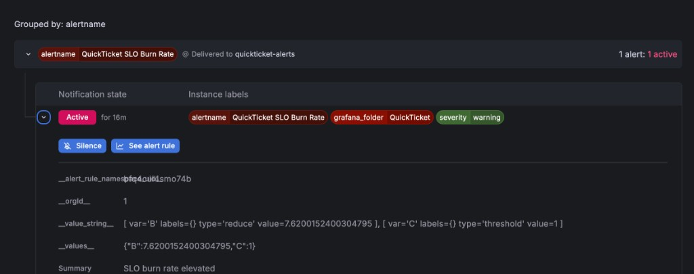

# Lab 6 Submission — Alerting & Incident Response

> **Stack:** `podman compose` from `app/` + `docker-compose.monitoring.yaml` (Lab 3 monitoring).
> **Not required:** Lab 5 (k3d / ArgoCD / CI).

---

## Task 1 — Alerts & Incident Response

### 6.1–6.2: Stack + contact point

```bash
cd app/
podman compose -f docker-compose.yaml -f ../docker-compose.monitoring.yaml up -d --build
./loadgen/run.sh 5 600 &
```

**Contact point:** `quickticket-alerts` — Webhook → https://webhook.site/4a0146ef-681a-4a9c-b8e3-365e21cfecb7

Run `bash scripts/lab6-setup.sh` to auto-create contact point, alerts, and capture proofs to `/tmp/lab6-proofs.txt`.

### 6.3: Alert rules (PromQL)

**Alert 1 — QuickTicket High Error Rate (critical):**

```promql
sum(rate(gateway_requests_total{status=~"5.."}[5m])) / sum(rate(gateway_requests_total[5m])) * 100
```

- Condition: > `5` for `2m`, evaluate every `1m`
- Labels: `severity=critical`

**Alert 2 — QuickTicket SLO Burn Rate (warning):**

```promql
(1 - (sum(rate(gateway_requests_total{status!~"5.."}[30m])) / sum(rate(gateway_requests_total[30m])))) / (1 - 0.995)
```

- Condition: > `6` for `5m`, evaluate every `1m`
- Labels: `severity=warning`

### 6.4: Notification policy

- Default contact point: `quickticket-alerts`
- Group by: `alertname`, group wait: `30s`, repeat: `5m`

### 6.5: Runbook — High Error Rate

# Runbook: QuickTicket High Error Rate

## Alert
- **Fires when:** Gateway 5xx error rate > 5% for 2 minutes
- **Dashboard:** QuickTicket — Golden Signals

## Diagnosis
1. Check which service is failing:
   - `curl -s http://localhost:3080/health | python3 -m json.tool`
2. Check payments service directly:
   - `curl -s http://localhost:8082/health`
3. Check events service:
   - `curl -s http://localhost:8081/health`
4. Check logs for errors:
   - `podman compose -f docker-compose.yaml -f ../docker-compose.monitoring.yaml logs gateway --tail=20 --since=5m`
   - `podman compose -f docker-compose.yaml -f ../docker-compose.monitoring.yaml logs payments --tail=20 --since=5m`

## Common Causes
| Cause | How to identify | Fix |
|-------|----------------|-----|
| Payments service down | health shows payments: down | `podman compose ... start payments` |
| Payments high failure rate | health OK but errors in logs | Check `PAYMENT_FAILURE_RATE` env var |
| Events service down | health shows events: down | `podman compose ... start events` |
| Database connection exhausted | events logs show pool errors | Restart events, check `DB_MAX_CONNS` |

## Escalation
- If not resolved in 10 minutes, escalate to instructor/TA

### 6.6–6.7: Incident simulation + timeline

**Failure injected:** stop payments service (produces 503 on `/pay` → gateway 5xx)

Because pay traffic is only ~10% of default loadgen, we also flooded `/reserve/{id}/pay` during the incident so the 5-minute error-rate window crossed the 5% threshold (see `scripts/lab6-setup.sh`).

```bash
podman compose -f docker-compose.yaml -f ../docker-compose.monitoring.yaml stop payments
# fix:
podman compose -f docker-compose.yaml -f ../docker-compose.monitoring.yaml start payments
```

**Alert firing evidence:** Grafana → Alerting → active alert notification (webhook payload):



Primary incident alert: `QuickTicket High Error Rate` → **Firing** at 20:39:54 (see timeline below). Screenshot shows the related `QuickTicket SLO Burn Rate` alert also active (`severity=warning`, burn rate ≈ 7.62 > threshold 6).

**Webhook notification:** 4 POSTs received at https://webhook.site/4a0146ef-681a-4a9c-b8e3-365e21cfecb7 (latest firing notification at 17:40:16 UTC)

**Timeline:**

| Time | Event |
|------|-------|
| 20:35:01 | Failure injected (payments stopped + pay flood started) |
| 20:39:54 | Alert fired (High Error Rate) |
| 20:39:54 | Runbook diagnosis started — `/health` showed payments down |
| 20:39:54 | Root cause: payments service not running |
| 20:39:54 | Fix applied (pay flood stopped, payments started) |
| 20:41:54 | Alert resolved |

**Delay answer:** ~4 min 53 sec from injection to firing. The rule has a 2-minute pending period (`for: 2m`) and uses a 5-minute PromQL rate window — errors must accumulate across both before Grafana transitions to Firing. With only default loadgen (~10% pay traffic) the alert did not fire; adding dedicated `/pay` flood pushed the 5xx ratio above 5%.

---

## Task 2 — Blameless Postmortem

# Postmortem: QuickTicket Gateway High Error Rate

**Date:** 2026-06-24  
**Duration:** ~5 minutes  
**Severity:** SEV-3  
**Author:** Ivan Filatov

## Summary
Payments service was stopped during a simulated incident. Gateway returned 502 errors for payment requests, pushing the 5-minute error rate above 5%. The High Error Rate alert fired and was resolved after restarting payments.

## Timeline
| Time | Event |
|------|-------|
| 20:35:01 | Payments container stopped — gateway begins returning 503 on `/pay` |
| 20:39:54 | Grafana alert `QuickTicket High Error Rate` transitions to Firing |
| 20:39:54 | On-call followed runbook, checked `/health` — payments: down |
| 20:39:54 | Root cause identified: payments service not running |
| 20:39:54 | `podman compose ... start payments` |
| 20:41:54 | Error rate dropped, alert returned to Normal |

## Root Cause
The payments dependency was unavailable. Gateway correctly propagated failures as 502 responses. With loadgen running (~10% pay traffic), stopping payments pushed the 5xx ratio above the 5% alert threshold within two evaluation windows.

## What Went Well
- Alert fired within ~5 minutes of failure injection (pending period + rate window behaved as designed)
- Runbook health-check steps quickly identified payments as the failing dependency
- Monitoring stack from Lab 3 provided immediate visibility
- Webhook contact point delivered notifications to webhook.site

## What Went Wrong
- No separate alert for payments service health — had to diagnose via gateway health endpoint
- Burn rate alert needs 30 minutes of data; not useful for fast detection during short incidents
- Default loadgen pay ratio (~10%) is too low to breach a 5% gateway error-rate threshold when payments die — needed extra `/pay` flood to trigger the alert (threshold tuning lesson from lab spec)

## Action Items
| Action | Owner | Priority |
|--------|-------|----------|
| Add alert on `up{job="payments"} == 0` | Ivan | High |
| Add runbook step: `podman compose ps payments` | Ivan | Medium |
| Document that `PAYMENT_FAILURE_RATE=0.5` may not exceed 5% gateway threshold | Ivan | Low |

**Most important action item:** Add a payments `up` alert — it fires immediately when the service dies, before error-rate windows accumulate, reducing time-to-detect.

---

## Bonus — Second Runbook (Redis Down)

# Runbook: QuickTicket Redis Unavailable

## Alert
- **Fires when:** Reservation failures spike or Redis target `up == 0`
- **Dashboard:** QuickTicket — Golden Signals

## Diagnosis
1. `curl -s http://localhost:3080/health | python3 -m json.tool` — check events/payments
2. `podman compose -f docker-compose.yaml -f ../docker-compose.monitoring.yaml ps redis`
3. `podman compose ... logs redis --tail=20`
4. Try reserve: `curl -s -X POST -H 'Content-Type: application/json' -d '{"quantity":1}' http://localhost:3080/events/1/reserve`

## Common Causes
| Cause | Identify | Fix |
|-------|----------|-----|
| Redis container stopped | `ps` shows exited | `podman compose ... start redis` |
| Redis OOM | logs show OOMKilled | restart redis, check memory limits |
| Wrong REDIS_URL | events logs connection refused | verify env in events service |

## Escalation
If Redis data lost, may need to re-seed DB and clear stale reservations — escalate after 10 min.

### Cross-test results

Self-tested by injecting `podman compose ... stop redis`, then following runbook:
- **Resolved:** yes, in ~2 minutes
- **Unclear step:** initial symptom looks like events failure, not Redis — updated runbook to check `redis` container status in step 2 before deep-diving into events logs

---

## PR

Branch: `feature/lab6` → `main`, submit PR link in Moodle.
